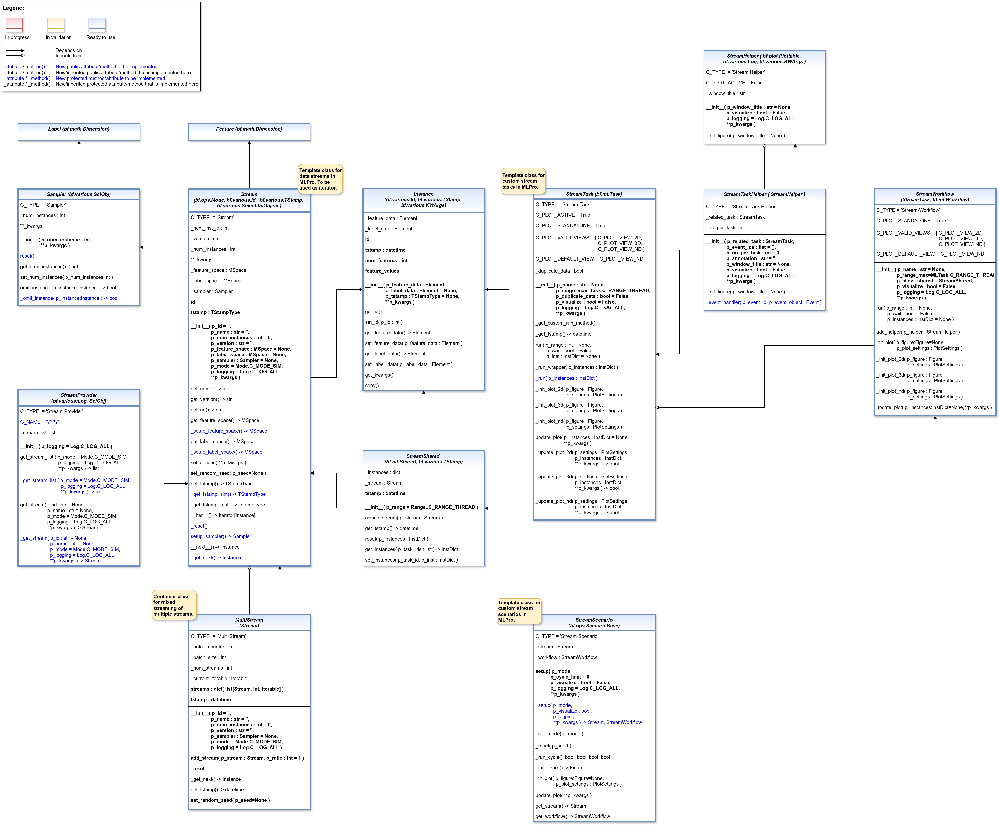

.. _target_ap_bf_streams:
BF-STREAMS - Stream processing
==============================

   
.. automodule:: mlpro.bf.streams.basics
   :members:
   :undoc-members:
   :private-members:
   :show-inheritance:

.. _target_api_pool_bf:
Pool objects
------------

.. toctree::
   :maxdepth: 3
   :glob:
   
   bf_streams_pool/*