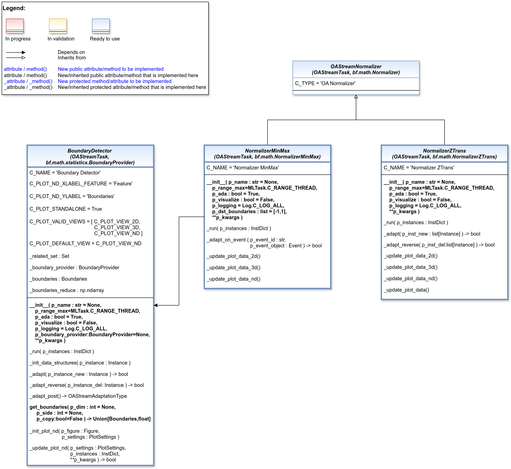

.. _target_api_oa_stream_tasks_prepro:
Preprocessing
=============

   

Boundary detector
-----------------

.. automodule:: mlpro.oa.streams.tasks.boundarydetector
   :members:
   :undoc-members:
   :private-members:
   :show-inheritance:

Normalizer MinMax
-----------------

.. automodule:: mlpro.oa.streams.tasks.normalizers.minmax
   :members:
   :undoc-members:
   :private-members:
   :show-inheritance:

Normalizer ZTrans
-----------------

.. automodule:: mlpro.oa.streams.tasks.normalizers.ztrans
   :members:
   :undoc-members:
   :private-members:
   :show-inheritance: