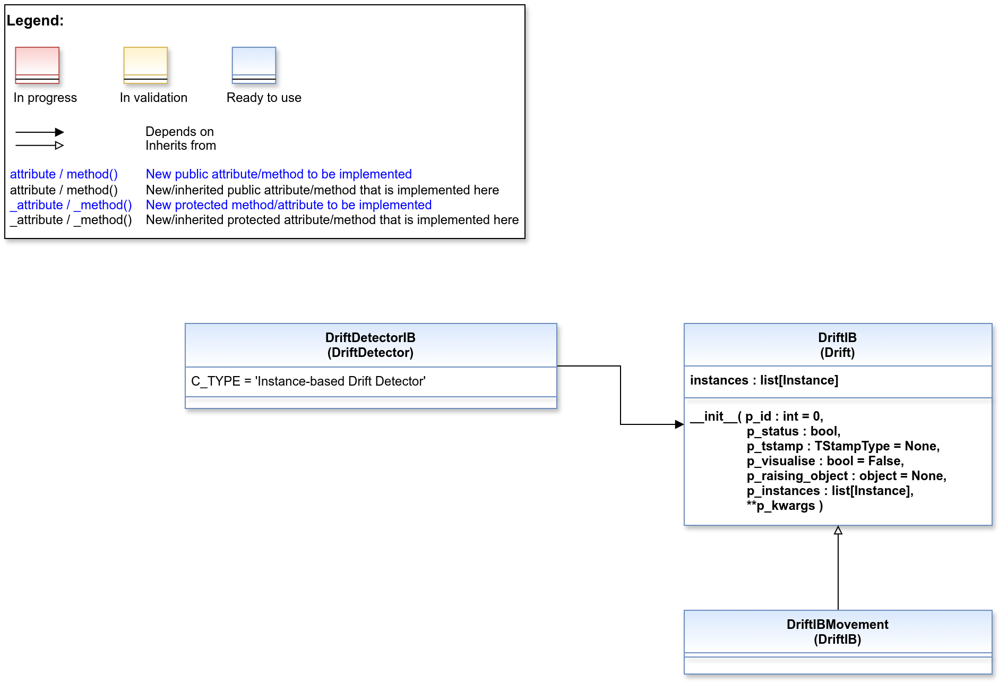

.. _target_api_oa_stream_tasks_dd_ib:
Instance-based drifts and detectors
===================================

.. automodule:: mlpro.oa.streams.tasks.changedetectors.driftdetectors.instancebased.basics
   :members:
   :undoc-members:
   :private-members:
   :show-inheritance:

.. automodule:: mlpro.oa.streams.tasks.changedetectors.driftdetectors.drifts.instancebased.basics
   :members:
   :undoc-members:
   :private-members:
   :show-inheritance:
   

.. toctree::
   :maxdepth: 2
   :glob:
   
   10_instance_based/*