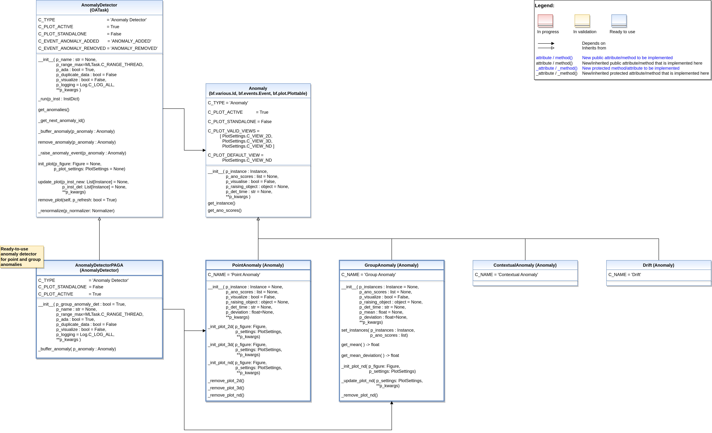

.. _target_api_oa_stream_tasks_ad:
Anomaly Detectors
=================

   
   
Template for anomaly detectors
------------------------------

.. automodule:: mlpro.oa.streams.tasks.anomalydetectors.basics
   :members:
   :undoc-members:
   :private-members:
   :show-inheritance:

Template for anomalies
----------------------

.. automodule:: mlpro.oa.streams.tasks.anomalydetectors.anomalies.basics
   :members:
   :undoc-members:
   :private-members:
   :show-inheritance:

Concrete anomalies and algorithms
---------------------------------

.. toctree::
   :maxdepth: 2
   :glob:
   
   anomaly_detectors/*
