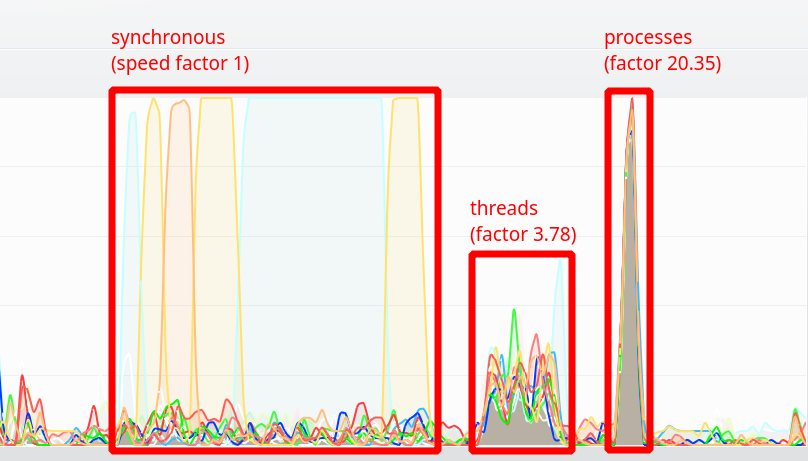

.. _Howto BF MT 001:
Howto BF-MT-001: Multitasking - Parallel Algorithms
===================================================

.. automodule:: mlpro.bf.examples.howto_bf_mt_001_parallel_algorithms

Executable code
---------------
.. literalinclude:: ../../../../../src/mlpro/bf/examples/howto_bf_mt_001_parallel_algorithms.py
	:language: python

Results
-------

The howto example logs details of the three runs and in particular the speed factors of multithreading and 
multiprocessing in comparison to the serial/synchronous execution. On a PC with an AMD Ryzen 7 CPU (8/16 cores)
running Linux, the system monitor shows an approx. 4x speedup with multithreading and an approx. 20x speedup with multiprocessing.

