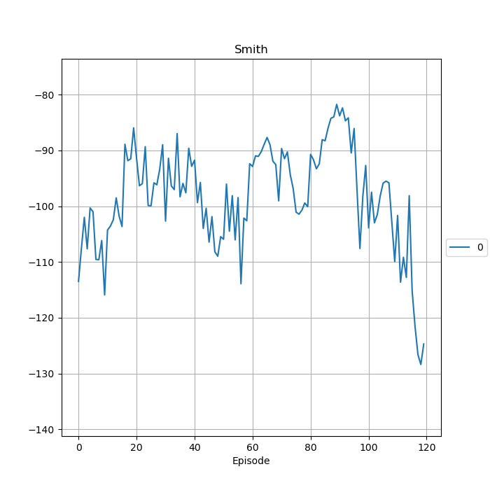

.. _Howto Env RL 002:
Howto RL-ENV-002: SB3 Policy on RobotHTM Environment
=============================================================================================

.. automodule:: mlpro.rl.examples.howto_rl_env_002_train_agent_with_SB3_policy_on_robothtm_environment

Prerequisites
-------------

Please install the following packages to run this examples properly:
    - `Pytorch <https://pypi.org/project/torch/>`_
    - `Stable-Baselines3 <https://pypi.org/project/stable-baselines3/>`_
  ..
   

Executable code
---------------
.. literalinclude:: ../../../../../../src/mlpro/rl/examples/howto_rl_env_002_train_agent_with_SB3_policy_on_robothtm_environment.py
	:language: python

Results
-------

After the environment is initiated, the training will run for the specified amount of limits.
However, it is noted that there is no visualization available for this environment.
The training log is stored in the location specified and a figure plot similar to the figure 
above will be produced.

.. code-block:: bash

    YYYY-MM-DD  HH:MM:SS.SSSSSS  W  Results  RL: ------------------------------------------------------------------------------ 
    YYYY-MM-DD  HH:MM:SS.SSSSSS  W  Results  RL: -- Training Results of run 0 
    YYYY-MM-DD  HH:MM:SS.SSSSSS  W  Results  RL: ------------------------------------------------------------------------------ 
    YYYY-MM-DD  HH:MM:SS.SSSSSS  W  Results  RL: ------------------------------------------------------------------------------ 
    YYYY-MM-DD  HH:MM:SS.SSSSSS  W  Results  RL: -- Scenario          : RL-Scenario Matrix 
    YYYY-MM-DD  HH:MM:SS.SSSSSS  W  Results  RL: -- Model             : Agent Smith 
    YYYY-MM-DD  HH:MM:SS.SSSSSS  W  Results  RL: -- Start time stamp  : YYYY-MM-DD HH:MM:SS.SSSSSS 
    YYYY-MM-DD  HH:MM:SS.SSSSSS  W  Results  RL: -- End time stamp    : YYYY-MM-DD HH:MM:SS.SSSSSS 
    YYYY-MM-DD  HH:MM:SS.SSSSSS  W  Results  RL: -- Duration          : 0:00:59.209252 
    YYYY-MM-DD  HH:MM:SS.SSSSSS  W  Results  RL: -- Start cycle id    : 0 
    YYYY-MM-DD  HH:MM:SS.SSSSSS  W  Results  RL: -- End cycle id      : 11999 
    YYYY-MM-DD  HH:MM:SS.SSSSSS  W  Results  RL: -- Training cycles   : 12000 
    YYYY-MM-DD  HH:MM:SS.SSSSSS  W  Results  RL: -- Evaluation cycles : 12500 
    YYYY-MM-DD  HH:MM:SS.SSSSSS  W  Results  RL: -- Adaptations       : 120 
    YYYY-MM-DD  HH:MM:SS.SSSSSS  W  Results  RL: -- High score        : -83.8038799825578 
    YYYY-MM-DD  HH:MM:SS.SSSSSS  W  Results  RL: -- Results stored in : "C:\Users\%username%\YYYY-MM-DD  HH:MM:SS Training RL" 
    YYYY-MM-DD  HH:MM:SS.SSSSSS  W  Results  RL: -- Training Episodes : 120 
    YYYY-MM-DD  HH:MM:SS.SSSSSS  W  Results  RL: -- Evaluations       : 25 
    YYYY-MM-DD  HH:MM:SS.SSSSSS  W  Results  RL: ------------------------------------------------------------------------------ 
    YYYY-MM-DD  HH:MM:SS.SSSSSS  W  Results  RL: ------------------------------------------------------------------------------ 
    
The local result folder contains the training result files:
    - agent_actions.csv
    - env_rewards.csv
    - env_states.csv
    - evaluation.csv
    - summary.csv
    - trained model.pkl
