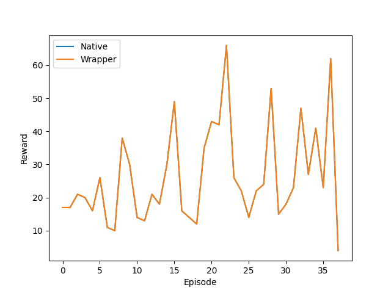

.. _Howto RL 13:
`Howto 13 - (RL) Comparison Native and Wrapper SB3 Policy <https://github.com/fhswf/MLPro/blob/main/examples/rl/Howto%2013%20-%20(RL)%20Comparison%20Native%20and%20Wrapper%20SB3%20Policy.py>`_
================
Ver. 1.0.7 (2022-03-21)

This module compares the native and wrapped implementation of the SB3 Policy on an
environment.

Prerequisites
`````````````````

Please install the following packages to run this examples properly:
    - :ref:`MLPro <Installation>`
    - `Pytorch <https://pypi.org/project/torch/>`_
    - `OpenAI Gym <https://pypi.org/project/gym/>`_
    - `Stable-Baselines3 <https://pypi.org/project/stable-baselines3/>`_
  ..
    - `NumPy <https://pypi.org/project/numpy/>`_
  ..
    - `Matplotlib <https://pypi.org/project/matplotlib/>`_
  ..
    - `PettingZoo <https://pypi.org/project/PettingZoo/>`_
  ..
    - `Optuna <https://pypi.org/project/optuna/>`_
  ..
    - `Hyperopt <https://pypi.org/project/hyperopt/>`_
  ..
    - `ROS <http://wiki.ros.org/noetic/Installation>`_
    

Results
`````````````````


The plot from native and wrapped implementation should be indiscernible between each other. 
The figure above is an example of successful algorithm wrapping. 

Example Code
`````````````````

.. literalinclude:: ../../../../../examples/rl/Howto 13 - (RL) Comparison Native and Wrapper SB3 Policy.py
    :language: python

