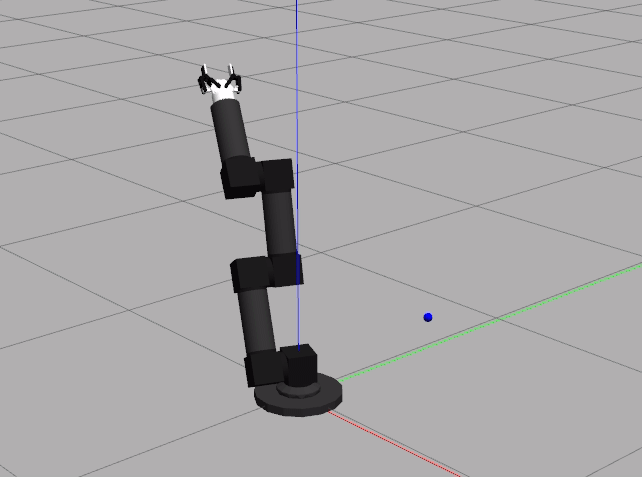

.. _Howto RL 20:
`Howto 20 - (RL) Train Multi Geometry with SB3 wrapper <https://github.com/fhswf/MLPro/blob/main/examples/rl/Howto%2020%20-%20(RL)%20Train%20Multi%20Geometry%20with%20SB3%20wrapper.py>`_
================
Ver. 1.0.1 (2022-04-21)

This module shows how to use SB3 wrapper to train Multi Geometry Robot

Prerequisites
`````````````````

Please install the following packages to run this examples properly:
    - :ref:`MLPro <Installation>`
    - `Stable-Baselines3 <https://pypi.org/project/stable-baselines3/>`_
    - :ref:`RL Environment Multi Geometry Robot <multigeorobot>`
    - `NumPy <https://pypi.org/project/numpy/>`_
    - `Matplotlib <https://pypi.org/project/matplotlib/>`_
    - `OpenAI Gym <https://pypi.org/project/gym/>`_
    - `Pytorch <https://pypi.org/project/torch/>`_
  ..
    - `PettingZoo <https://pypi.org/project/PettingZoo/>`_
  ..
    - `Optuna <https://pypi.org/project/optuna/>`_
  ..
    - `Hyperopt <https://pypi.org/project/hyperopt/>`_
  ..
    - `ROS <http://wiki.ros.org/noetic/Installation>`_
    

Results
`````````````````


The Gazebo GUI should be the first thing that shows up. 
The Multi Geometry robot will move depending on the given action and the training is run. 
When the training is done, the logged rewards will be plotted using the matplotlib library.

The plotted figure is is not reproducible due to the simulator's nature of simulating real
world scenario. Although seeds can be set for the random generator, the sampling cannot be 
done at the exact same time during different runs. For a more reproducible result, 
:ref:`the 20th example <Howto RL 20>` is more appropriate.

Example Code
`````````````````

.. literalinclude:: ../../../../../examples/rl/Howto 20 - (RL) Train Multi Geometry with SB3 wrapper.py
    :language: python

