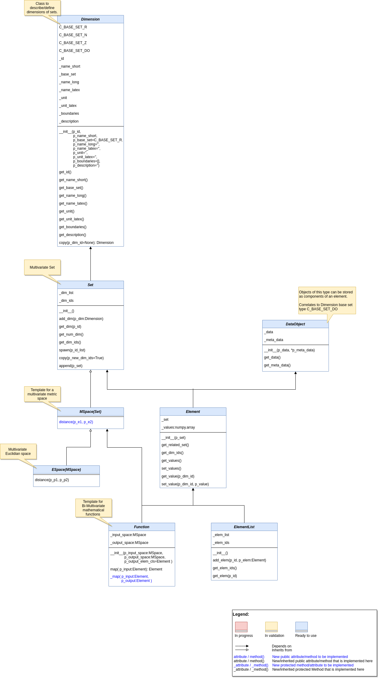
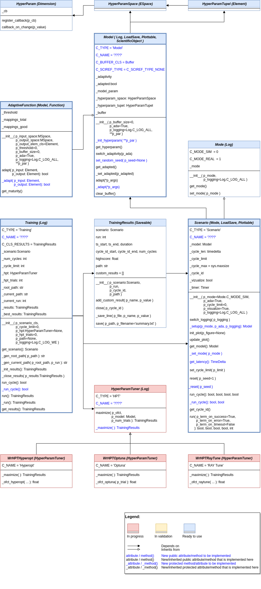
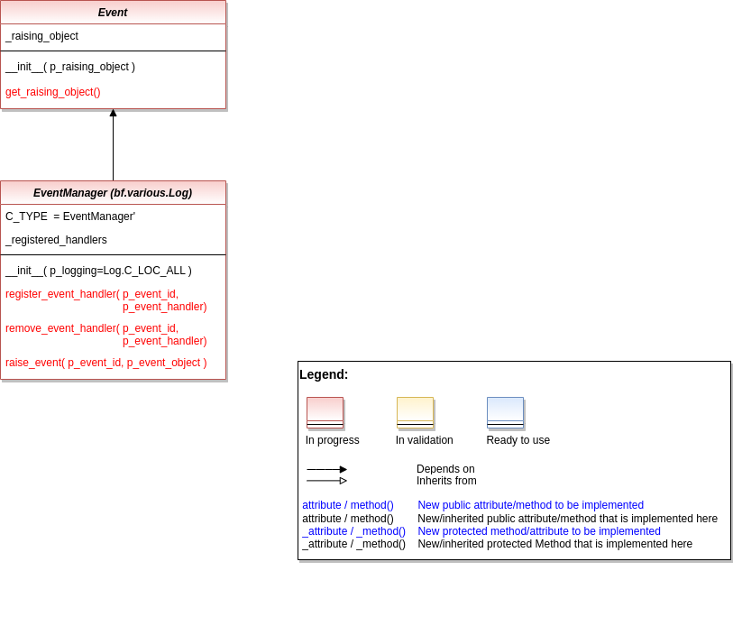

Basic Functions
================

Various
----------------

.. automodule:: mlpro.bf.various
   :members:
   :undoc-members:
   :show-inheritance:

   
Mathematics
-----------

.. automodule:: mlpro.bf.math
   :members:
   :undoc-members:
   :show-inheritance:

   
Data Management
---------------

.. automodule:: mlpro.bf.data
   :members:
   :undoc-members:
   :show-inheritance:

   
Data Plotting
-------------

.. automodule:: mlpro.bf.plot
   :members:
   :undoc-members:
   :show-inheritance:

   
Machine Learning
----------------

.. automodule:: mlpro.bf.ml
   :members:
   :undoc-members:
   :show-inheritance:
   

Event Handling
--------------

.. automodule:: mlpro.bf.events
   :members:
   :undoc-members:
   :private-members:
   :show-inheritance:

   
Exceptions
----------

.. automodule:: mlpro.bf.exceptions
   :members:
   :undoc-members:
   :show-inheritance:

User Interaction
----------------

.. toctree::
   :maxdepth: 3

   ui/mlpro.ui.sciui
