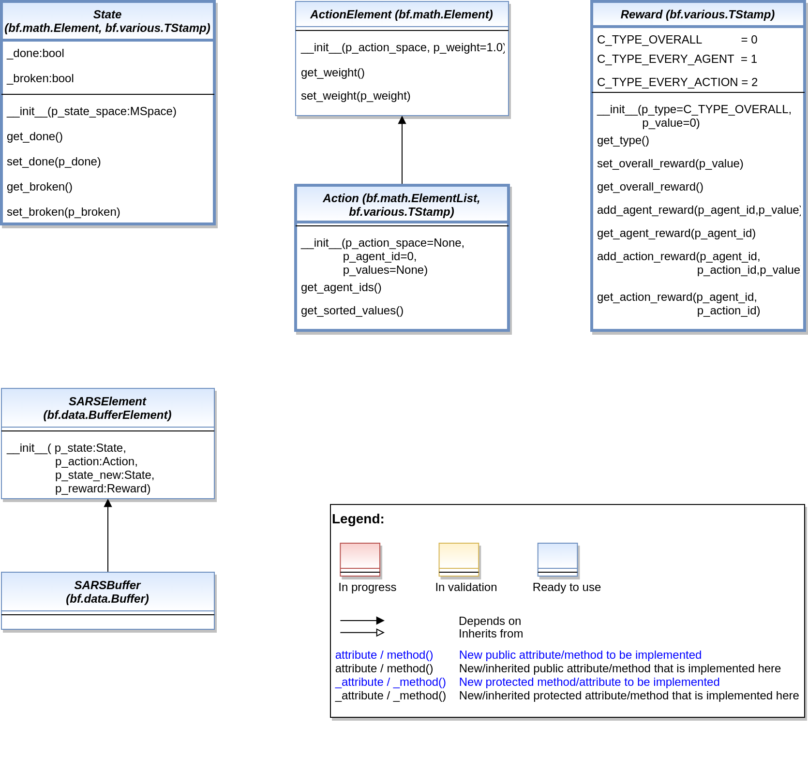
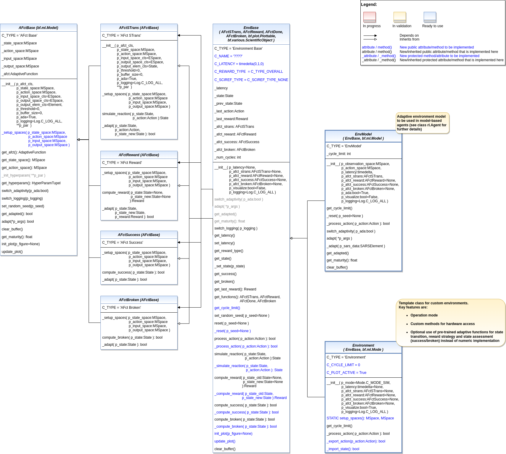
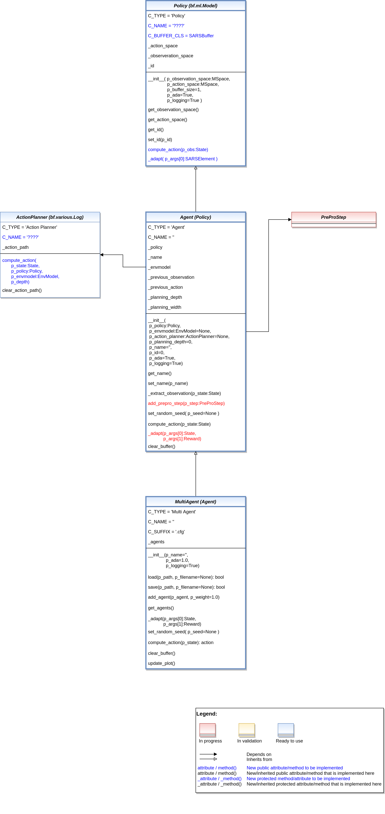
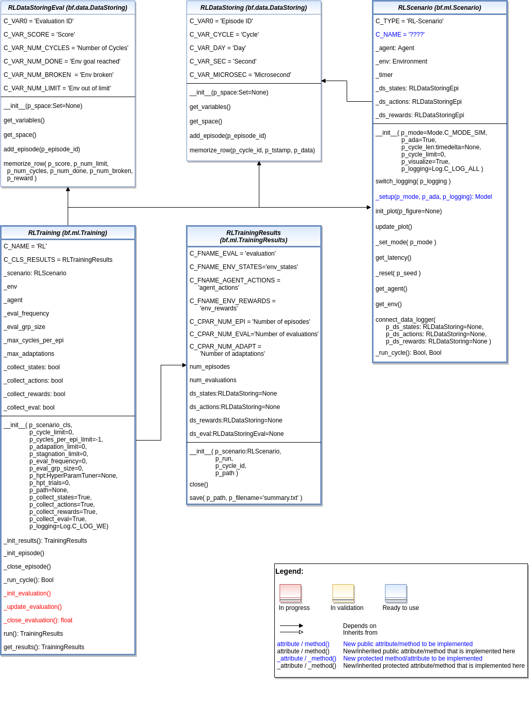

Reinforcement Learning
========================

States, Actions, Rewards
-------------------------

.. automodule:: mlpro.rl.models_sar
   :members:
   :undoc-members:
   :show-inheritance:
   
Environments
-------------------

.. automodule:: mlpro.rl.models_env
   :members:
   :undoc-members:
   :show-inheritance:
   
Agents
------------------

.. automodule:: mlpro.rl.models_agents
   :members:
   :undoc-members:
   :show-inheritance:
   
   
Training and Tuning
---------------------

.. automodule:: mlpro.rl.models_train
   :members:
   :undoc-members:
   :show-inheritance:
