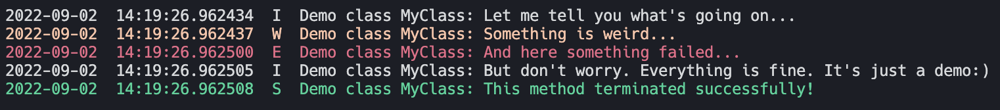

Logging
----------------
This class adds elementary log functionality to inherited classes. The base class of Log can be access by the following:

.. code-block:: python

    from mlpro.bf.various import Log

The log structure is divided into: 
 * Date : Current date in format year-month-day
 * Time : Current time in format hour:minute:second
 * Log Type : The type of logging
 * Log Text : The text that is being logged to the console

An example of logging functionality is shown in the figure below.

In the figure above, it is shown that each log type has its own text color. Each log type is assigned to a color.

\Here is the list of the color:
 * Information (I) : White
 * Warning (W) : Yellow
 * Error (E) : Red
 * Success (S) : Green

In the initialization, the logging level of object needs to be defined. By default, it will log all the informations; Information, Warning, Error, and Success.
The user can specify which information that needs to be logged. The user can also change the logging level after the initialization with ``switch_logging(p_logging)``.

\The following are the identifier for ``p_logging``:
 * Log.C_LOG_ALL : Information, Warning, Error, Success
 * Log.C_LOG_WE : Warning, Error
 * Log.C_LOG_E : Error
 * Log.C_LOG_NOTHING : Nothing

To log an information, function ``log(p_type, *pargs)`` needs to be called. The ``p_type`` is the type of logging. In the ``*pargs``, the user can put the information in tuple.

\Here is the list for ``p_type``:
 * Log.C_LOG_TYPE_I : Information
 * Log.C_LOG_TYPE_W : Warning
 * Log.C_LOG_TYPE_E : Error
 * Log.C_LOG_TYPE_S : Success

.. code-block:: python

    from mlpro.bf.various import Log

    class MyRandomClass(Log):

        def __init__(self, p_logging=True):
            # The constructor of class Log initializes the internal logging
            super().__init__(p_logging=p_logging)

        def random_method(self):
            self.log(self.C_LOG_TYPE_I, "Hi, I am information!")
            self.log(self.C_LOG_TYPE_W, "Hi, I am warning!")
            self.log(self.C_LOG_TYPE_E, "Hi, I am error!")
            self.log(self.C_LOG_TYPE_S, "Hi, I am success!")

    if __name__ == "__main__":
        # Initilaization
        my_random_class = MyRandomClass(p_logging=Log.C_LOG_ALL)

        # Switch the logging level to Log.C_LOG_WE
        my_random_class.switch_logging(Log.C_LOG_WE)

        # Switch the logging level to Log.C_LOG_E
        my_random_class.switch_logging(Log.C_LOG_E)

        # Switch the logging level to Log.C_LOG_NOTHING
        my_random_class.switch_logging(Log.C_LOG_NOTHING)