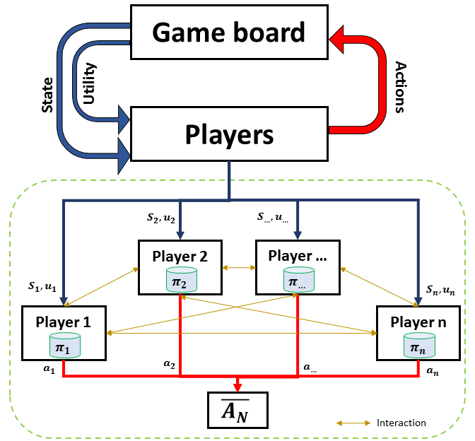
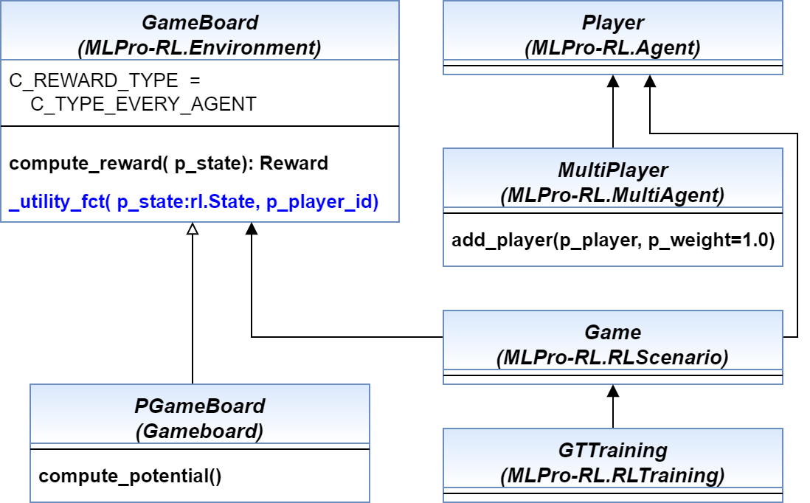

5.1 Overview
================

Game Theory (GT) is a well-known branch in economic studies as a theoretical approach to model the strategic
interaction between multiple individuals or players in a specific circumtance. GT can also be adopted in the scientific and engineering area, for instance,
to optimize decision-making processes in a strategic setting. Moreover, GT has been successfully solved Multi-Agent Reinfrocement Learning (MARL) problems.
If you would like to know more about the corporation between GT and MARL, you can have a look at these papers:
`(1) self-optimization using a State-based Potential Game approach <https://www.researchgate.net/publication/341980093_Distributed_Self-Optimization_of_Modular_Production_Units_A_State-Based_Potential_Game_Approach>`_ and
`(2) potential game-based distributed optimization of a production unit <https://www.researchgate.net/publication/332868950_Potential_Game_based_Distributed_Optimization_of_Modular_Production_Units>`_.

MLPro-GT is developed as a sub-framework for the cooperative GT approach to solving MARL problems by inheriting a handful of main functionalities of MLPro-RL,
such as the environment model, the agent model, and the environment-agent interaction model. This sub-framework foucuses on the cooperative GT approach on Markov games.
A Markov game contains a group of independent players that make decisions simultaneuosly, see the figure below for overview.

  
  This figure is taken from `MLPro 1.0 paper <https://doi.org/10.1016/j.mlwa.2022.100341>`_.

Additionally, you can find the more comprehensive explanations of MLPro-GT including a sample application and difference with a native RL approach in this paper:
`MLPro 1.0 - Standardized Reinforcement Learning and Game Theory in Python <https://www.researchgate.net/publication/359440328_MLPro_10_-_Standardized_Reinforcement_Learning_and_Game_Theory_in_Python>`_.
The simplified diagram below shows the architecture of MLPro-GT, where MLPro-GT serves as a child package and MLPro-RL is its parent package.

  
  This figure is taken from `MLPro 1.0 paper <https://doi.org/10.1016/j.mlwa.2022.100341>`_.

If you are interested to utilize MLPro-GT, you can easily access the GT modules, as follows:

    .. code-block:: python

        from mlpro.gt.models import *

You can also check out some of the examples on our `how to files <https://mlpro.readthedocs.io/en/latest/content/append1/howto.gt.html>`_
or `here <https://github.com/fhswf/MLPro/tree/main/examples/gt>`_.