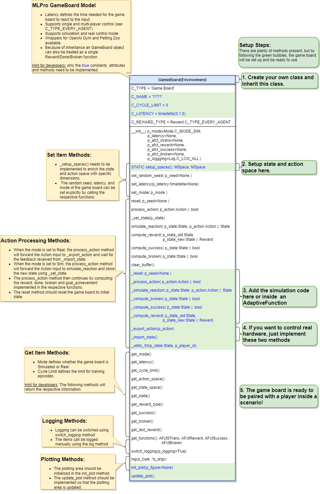

Custom Game boards
-------------------

- **Game Board Creation for Simulation Mode**

    To create a game board that satisfies MLPro interface is immensly simple and straigtforward.
    Basically a MLPro game board is a class with several main functions. Each game board must apply the
    following mlpro functions:
    
    .. code-block:: python
        
        from mlpro.gt.models import *
        
        class MyGameBoard(GameBoard):
            """
            Custom game board that satisfies mlpro interface.
            """
            C_NAME          = 'MyGameboard'
            C_LATENCY       = timedelta(0,1,0)             # Default latency 1s
            C_REWARD_TYPE   = Reward.C_TYPE_EVERY_AGENT    # Default reward type
            
            def __init__(self, p_mode=C_MODE_SIM, p_latency:timedelta=None, p_logging=True):
                """
                Parameters:
                    p_mode              Mode of environment (simulation/real)
                    p_latency           Optional: latency of environment. If not provided
                                        internal value C_LATENCY will be used by default
                    p_logging           Boolean switch for logging
                """
        
                super().__init__(p_latency=p_latency, p_logging=p_logging)
                self._setup_spaces()
                self.set_mode(p_mode)
            
            def _setup_spaces(self):
                """
                Static template method to set up and return state and action space of environment.
                
                Returns
                -------
                state_space : MSpace
                    State space object
                action_space : MSpace
                    Action space object
                """
        
                # Setup state space example
                # self.state_space.add_dim(Dimension('Pos', 'Position', '', 'm', 'm', [-50,50]))
                # self.state_space.add_dim(Dimension('Vel', 'Velocity', '', 'm/sec', '\frac{m}{sec}', [-50,50]))
        
                # Setup action space example
                # self.action_space.add_dim(Dimension('Rot', 'Rotation', '', '1/sec', '\frac{1}{sec}', [-50,50]))
                ....

            def _process_action(self, p_action: Action) -> bool:
                """
                Custom method for state transition. To be implemented in a child class. See method 
                process_action() for further details.

                Parameters
                ----------
                p_action : Action
                    Action to be processed

                Returns
                -------
                success : bool
                    True, if action processing was successfull. False otherwise.
                """
                ....
            
            def _simulate_reaction(self, p_state: State, p_action: Action) -> State:
                """
                Custom implementation to simulate a state transition. See method simulate_reaction() for
                further details.

                Parameters
                ----------
                p_state : State
                    Current state.
                p_action : Action
                    Action.

                Returns
                -------
                State
                    Subsequent state after transition
                """
                ....
                
            def _reset(self, p_seed=None) -> None:
                """
                Custom method to reset the environment to an initial/defined state. 

                Parameters
                ----------
                p_seed : int
                    Seed parameter for an internal random generator

                """
                ....
                
            def _compute_reward(self, p_state_old: State, p_state_new: State) -> Reward:
                """
                Custom reward computation method. See method compute_reward() for further details.

                Parameters
                ----------
                p_state_old : State
                    Optional state before transition. If None the internal previous state of the environment
                    is used.
                p_state_new : State
                    Optional tate after transition. If None the internal current state of the environment
                    is used.

                Returns
                -------
                Reward
                    Reward object.
                """
                ....
                
            def _compute_success(self, p_state: State) -> bool:
                """
                Custom method for state evaluation 'success'. See method compute_success() for further details.

                Parameters
                ----------
                p_state : State
                    State to be assessed.

                Returns
                -------
                bool
                    True, if the given state is a 'success' state. False otherwise.
                """
                ....
                
            def _compute_success(self, p_state: State) -> bool:
                """
                Custom method for state evaluation 'success'. See method compute_success() for further details.

                Parameters
                ----------
                p_state : State
                    State to be assessed.

                Returns
                -------
                bool
                    True, if the given state is a 'success' state. False otherwise.
                """
                ....

            def _utility_fct(self, p_state: State, p_player_id):
                """
                Computes utility of given player. To be redefined.
                """
                ....
    
    One of the benefits for MLPro users is the variety of reward structures, which is useful for Multi-Agent GT
    and Game Theoretical approach. Three types of reward structures are supported in this framework, such as:
    
    1. **C_TYPE_OVERALL** as the default type and is a scalar overall value
    
    2. **C_TYPE_EVERY_AGENT** is a scalar for every agent
    
    3. **C_TYPE_EVERY_ACTION** is a scalar for every agent and action.
    
    To set up state- and action-spaces using our basic functionalities, please refer to our :ref:`how to File 02<target-howto>`
    or `here <https://github.com/fhswf/MLPro/blob/main/examples/bf/Howto%2002%20-%20(Math)%20Spaces%2C%20subspaces%20and%20elements.py>`_.
    Dimension class is currently improved and we will provide the explanation afterwards!

- **Game Board Creation for Real Hardware Mode**

    In MLPro, we can choose simulation mode or real hardward mode. For real hardware mode, the creation of
    an environment is very similar to simulation mode. You do not need to define **_simulate_reaction**, but you
    need to replace it with **_export_action** and **_import_state** as it is shown in the following:
    
    .. code-block:: python

        def _export_action(self, p_action: Action) -> bool:
            """
            Mode C_MODE_REAL only: exports given action to be processed externally 
            (for instance by a real hardware). Please redefine. 
        
            Parameters
            ----------
            p_action : Action
                Action to be exported
        
            Returns
            -------
            bool
                True, if action export was successful. False otherwise.
        
            """
        
            raise NotImplementedError
        
        def _import_state(self) -> bool:
            """
            Mode C_MODE_REAL only: imports state from an external system (for instance a real hardware). 
            Please redefine. Please use method set_state() for internal update.
        
            Returns
            -------
            bool
                True, if state import was successful. False otherwise.
        
            """
        
            raise NotImplementedError

- **Game Board Checker**

    To check whether your developed game board is compatible to MLPro interface, we provide a test script
    using unittest. At the moment, you can find the source code `here <https://github.com/fhswf/MLPro/blob/main/test/test_environment.py>`_.
    We will prepare a built-in testing module in MLPro, show you how to excecute the testing soon and provides an example as well.
