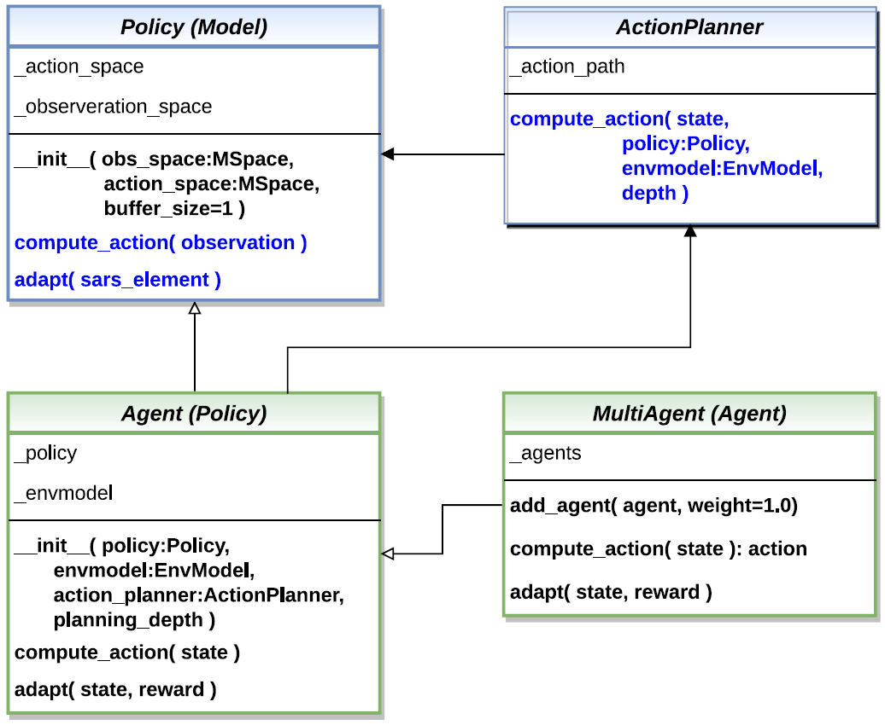
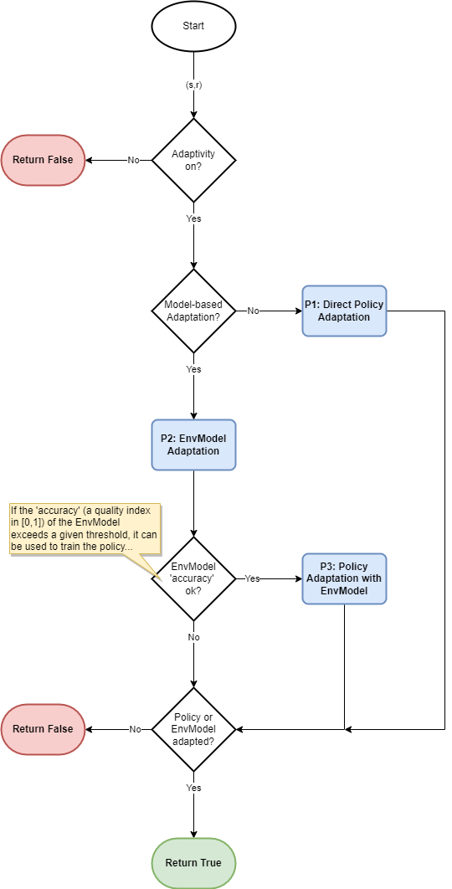

4.3 Agents
================

MLPro-RL supplies a special agent model landscape, which covers different RL scenarios including a simple single-agent RL, a multi-agent RL, and model-based agents with an optional action planner.
For the multi-agent RL, the structure is constructed by assigning multiple single agents in a group.
The main component of each single-agent (either single-agent or multi-agent RL) is the policy.
The basic class of the policy is inherited from the ML Model of basic MLPro functionality and extended by the RL-related function of the action calculation.
The users can inherit the basic class of the policy to implement their `own custom algorithms <https://mlpro.readthedocs.io/en/latest/content/rl/agents/custompolicies.html>`_ or simply use algorithms from third-party packages via `wrapper classes <https://mlpro.readthedocs.io/en/latest/content/rl/06_wrapper.html>`_.
The other possibility would be `importing algorithms from the pool object <https://mlpro.readthedocs.io/en/latest/content/rl/agents/pool.html>`_.
For an overview, the simplified class diagram of agents in MLPro is described below.

  
  This figure is taken from `MLPro 1.0 paper <https://doi.org/10.1016/j.mlwa.2022.100341>`_.

Moreover, an environment model (known as `EnvModel class <https://mlpro.readthedocs.io/en/latest/content/rl/agents/mbagents.html>`_) can be supplemented to a single-agent, i.e. for model-based RL cases.
This class can be used for model-based learning, which learns the behaviour or dynamics of the environment. Another possible extension of the model-based agent is an action planner.
Action planner uses the environment model (or EnvModel) to plan the next action by predicting the output on a certain horizon.
An example of action planner algorithms is `Model Predictive Control (MPC) <https://github.com/fhswf/MLPro/blob/main/src/mlpro/rl/pool/actionplanner/mpc.py>`_, which is also provided in MLPro.

Additionally, you can find the more comprehensive explanations of agents in MLPro-RL including a sample application on controlling a UR5 Robot in this paper:
`MLPro 1.0 - Standardized Reinforcement Learning and Game Theory in Python <https://doi.org/10.1016/j.mlwa.2022.100341>`_.

Here are some subsections of the agent model landscape of MLPro-RL, which might be interesting for the users:

.. toctree::
   :maxdepth: 1
   
   agents/custompolicies
   agents/pool
   agents/mbagents   
   agents/multiagents
   
The following flowchart describes the adaptation procedure of an agent. In the beginning, the loop checks whether it is model-based RL or model-free RL.
If it is a model-free RL, then the loop is jumped to a direct policy adaptation. Then, the current step is ended after the policy adaptation.
Meanwhile, in the model-based RL, the EnvModel is firstly adapted, and then the loop checks whether the accuracy of the EnvModel exceeds a given threshold.
This activity is to make sure that the EnvModel is accurate enough for policy adaptation. If the accuracy is higher than the threshold, then the policy adaptation takes place with EnvModel.
Otherwise, the current step is ended without any policy adaptations.
   

