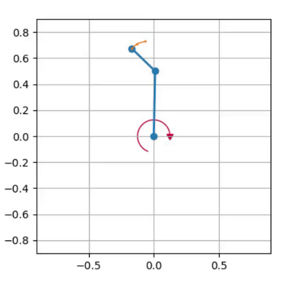

`Double Pendulum <https://github.com/fhswf/MLPro/blob/main/src/mlpro/rl/pool/envs/doublependulum.py>`_
^^^^^^^^^^^^^^^^^^^^^^^^^^^^^^^^^^^^^^^^^^^^^^^^^^^^^^^^^^^^^^^^^^^^^^^^^^^^^^^^^^^^^^^^^^^^^^^^^^^^^^^^^^^^^^^^

    
By default the lengths and weights of the pendulum are set to be 0.5 meters each and 0.5 kg each.
The user can customize this parameter and many other parameter to better suit the research
purpose. The other customizable parameter includes the starting pendulum positions and speeds, 
maximum torque and speed of the motor, the action frequency, and the time step. In addition, for 
visualization purpose, the history lengths can also be modified to a higher value to add more 
of the orange traces as shown on the figrue above. The environment is not episodical, which means
that the cycle limit should be defined manually to fit some training algorihtms. 

The double pendulum environment can be imported via:

.. code-block:: python

    import mlpro.rl.pool.envs.doublependulum
    
Prerequisites
=============

    - `NumPy <https://pypi.org/project/numpy/>`_
    - `Matplotlib <https://pypi.org/project/matplotlib/>`_
    - `SciPy <https://pypi.org/project/scipy/>`_
    - :ref:`MLPro <Installation>`

General Information
===================

+------------------------------------+-------------------------------------------------------+
|         Parameter                  |                         Value                         |
+====================================+=======================================================+
| Agents                             | 1                                                     |
+------------------------------------+-------------------------------------------------------+
| Native Source                      | MLPro                                                 |
+------------------------------------+-------------------------------------------------------+
| Action Space Dimension             | [1,]                                                  |
+------------------------------------+-------------------------------------------------------+
| Action Space Base Set              | Real number                                           |
+------------------------------------+-------------------------------------------------------+
| Action Space Boundaries            | Depends on max_torque                                 |
+------------------------------------+-------------------------------------------------------+
| State Space Dimension              | [4,]                                                  |
+------------------------------------+-------------------------------------------------------+
| State Space Base Set               | Real number                                           |
+------------------------------------+-------------------------------------------------------+
| State Space Boundaries             | Pi for position and None for speed                    |
+------------------------------------+-------------------------------------------------------+
| Reward Structure                   | Overall reward                                        |
+------------------------------------+-------------------------------------------------------+
 
Action Space
============

The continuous action is interpreted as a torque applied to the pendulum for a given time step. 
Depending on the max_speed parameter, this might not affect the system due to the pendulum
moving faster than the motor can handle.

State Space
===========

The state space of the system is a continuous space in the order of:
    - Position of Inner Pendulum
    - Speed of Inner Pendulum
    - Position of Outer Pendulum
    - Speed of Outer Pendulum
    
The position of the pendulum is guaranteed to be within -pi and pi, however the speed is not 
limited within a boundary due to the effects of gravitational acceleration.

  
Reward Structure
================

.. code-block:: python
    
    reward = Reward(Reward.C_TYPE_OVERALL)
        
    target = np.array([np.pi, 0.0, np.pi, 0.0])
    state = p_state_new.get_values()
    old_state = p_state_old.get_values()
    
    th1_count = 0
    for th1 in self.y[::-1, 0]:
        ang = np.degrees(DoublePendulum.angle_normalize(th1))
        if ang > 170 or ang < 190 or \
                ang < -170 or ang > -190:
            th1_count += 1
        else:
            break
    th1_distance = np.pi - abs(DoublePendulum.angle_normalize(np.radians(state[0])))
    th1_distance_costs = 4 if th1_distance <= 0.1 else 0.3 / th1_distance
    
    th1_speed_costs = np.pi * abs(state[1]) / self.max_speed
    
    # max acceleration in one timestep is assumed to be double the max speed
    th1_acceleration_costs = np.pi * abs(self.y[-1, 1]-self.y[-2, 1]) / (2 * self.max_speed)
    
    inner_pole_costs = (th1_distance_costs * th1_count / len(self.y)) - th1_speed_costs - (th1_acceleration_costs ** 0.5)
    inner_pole_weight = (self.l1/2)*self.m1
    
    th2_count = 0
    for th2 in self.y[::-1, 2]:
        ang = np.degrees(DoublePendulum.angle_normalize(th2))
        if ang > 170 or ang < 190 or \
                ang < -170 or ang > -190:
            th2_count += 1
        else:
            break
    th2_distance = np.pi - abs(DoublePendulum.angle_normalize(np.radians(state[2])))
    th2_distance_costs = 4 if th2_distance <= 0.1 else 0.3 / th2_distance
    
    th2_speed_costs = np.pi * abs(state[3]) / self.max_speed
    
    th2_acceleration_costs = np.pi * abs(self.y[-1, 3]-self.y[-2, 3]) / (2 * self.max_speed)
    
    outer_pole_costs = (th2_distance_costs * th2_count / len(self.y)) - th2_speed_costs - (th2_acceleration_costs ** 0.5)
    outer_pole_weight = 0.5 * (self.l2/2)*self.m2
    
    change_costs = ((np.linalg.norm(target[::2] - np.array(old_state)[::2])*inner_pole_weight) - 
                    (np.linalg.norm(target[::2] - np.array(state)[::2])*outer_pole_weight))
    
    reward.set_overall_reward((inner_pole_costs * inner_pole_weight) + (outer_pole_costs * outer_pole_weight) 
                              - (self.alpha * np.pi/2) + (change_costs))

    return reward
    
The reward calculation takes into account the position, speed and acceleration both pendulum. 
The class variable y take notes of the ODE frames of the states. This is formulated with the purpose of giving high reward whenever the pendulum stays upright 
while also minding the speed and acceleration of each pendulum. The position, speed, and acceleration
is not taken at face value but instead is treated as a percentage of a defined constant (\pi). Additionally,
a weighting system is used in the reward calculation to scale the importance of inner and outer pendulum rewards.
The torque exerted by the motor (alpha) is taken as negative reward and the difference between the old state and new state
is also taken into account.

Change Log
==========
    
+--------------------+---------------------------------------------+
| Version            | Changes                                     |
+====================+=============================================+
| 1.0.0              | First public version                        |
+--------------------+---------------------------------------------+
| 1.0.2              | Cleaning the code                           |
+--------------------+---------------------------------------------+
  
Cross Reference
===============
    + :ref:`API Reference <Double Pendulum>`