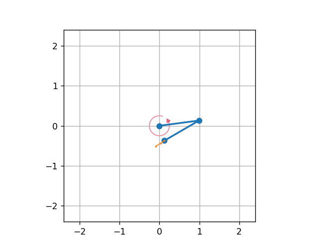

.. _DoublePendulum:
`Double Pendulum <https://github.com/fhswf/MLPro/blob/main/src/mlpro/rl/pool/envs/doublependulum.py>`_
^^^^^^^^^^^^^^^^^^^^^^^^^^^^^^^^^^^^^^^^^^^^^^^^^^^^^^^^^^^^^^^^^^^^^^^^^^^^^^^^^^^^^^^^^^^^^^^^^^^^^^^^^^^^^^^^

.. automodule:: mlpro.rl.pool.envs.doublependulum

.. note::
 MLPro provides two implementations of Double Pendulum environment named DoublePendulumS4 and DoublePendulumS7. 
    + The DoublePendulumS4 environment is a basic implementation with four dimensional state space including angles and angular velocities of both the poles.
    + The static 7 dimensional implementation of Double Pendulum environment in MLProis a seven dimensional state space with derived angular acceleration values and input torque. MLPro also provides a default reward strategy based on normalized state space and Euclidean Distances of the states.

The double pendulum environment can be imported via:

.. code-block:: python

    import mlpro.rl.pool.envs.doublependulum

The environment can be initialised with specifying the initial angles of both poles, masses of both poles, lenghts of poles, maximum torque value and scenario related parameters including step size and actuation step size. The initial positions of the poles refer to the position of the poles at the beginning of each RL episode, which can be set to 'up', 'down', 'random'. The default values for length and mass of each pole in the double pendulum are set to 1 and 1 respectively. The environment behaviour can be understood by running How To 20 in MLPro's sample implementation examples.

.. note::
 + The visualisation of the environment can be turned off by setting the visualize parameter in training/scenario initialisation to false

    
Prerequisites
=============
Please install below packages to use the MLPro's double pendulum environment

    - `NumPy <https://pypi.org/project/numpy/>`_
    - `Matplotlib <https://pypi.org/project/matplotlib/>`_
    - `SciPy <https://pypi.org/project/scipy/>`_

General Information
===================

+------------------------------------+-------------------------------------------------------+
|         Parameter                  |                         Value                         |
+====================================+=======================================================+
| Agents                             | 1                                                     |
+------------------------------------+-------------------------------------------------------+
| Native Source                      | MLPro                                                 |
+------------------------------------+-------------------------------------------------------+
| Action Space Dimension             | 1                                                     |
+------------------------------------+-------------------------------------------------------+
| Action Space Base Set              | Real number                                           |
+------------------------------------+-------------------------------------------------------+
| Action Space Boundaries            | Depends on max_torque                                 |
+------------------------------------+-------------------------------------------------------+
| State Space Dimension              | 4   (for DoublePendulumS4), 7  (for DoublePendulumS7) |
+------------------------------------+-------------------------------------------------------+
| State Space Base Set               | Real number                                           |
+------------------------------------+-------------------------------------------------------+
| State Space Boundaries             | [-180, 180] for angle and None for speed              |
+------------------------------------+-------------------------------------------------------+
| Reward Structure                   | Overall reward                                        |
+------------------------------------+-------------------------------------------------------+
 
Action Space
============
The goal of the environment is to maintain the vertical position of both the poles. The inner pole is actuated by a motor, and thus the action space of Double Pendulum environment is a continuous variable ranging between the negative maximum torque and positive maximum torque, where positive torque refers to clockwise torque and vice versa. The max torque can be passed as a :ref:`parameter <Double Pendulum>` in the initialisation of environment. 

+------------------------------------+-------------------------------------------------------+
|         Parameter                  |                         Range                         |
+====================================+=======================================================+
| Torque                             | [-max_torque, max_torque]                             |
+------------------------------------+-------------------------------------------------------+

State Space
===========

The state space for the double pendulum environment returns state of poles in the system including angles of both poles, velocity of poles, angular acceleration of the poles. The states for double pendulum environment can be understood by the table below.

+------------------------------------+------------------------------------+----------------------------------+-------------------------------------------------------+------------------------------+-------------------------+
|         State                      |         Description                |               Range              |			Unit				     |   DoublePendulumS4           |   DoublePendulumS7      |
+====================================+====================================+==================================+=======================================================+==============================+=========================+
| Theta 1                            |Angle of the inner pole             | [-180, 180]	                     |	degrees                                              |              X               |            X            |
+------------------------------------+------------------------------------+----------------------------------+-------------------------------------------------------+------------------------------+-------------------------+
| Omega 1                            |Angular velocity of inner pole      | [-800, 800]		             |	degrees per second                                   |		    X		    |            X            |
+------------------------------------+------------------------------------+----------------------------------+-------------------------------------------------------+------------------------------+-------------------------+
| Alpha 1                            |Angular Acceleration of outer pole  | [-6800, 6800]	             |	degrees per second squared                           |              -               |            X            |
+------------------------------------+------------------------------------+----------------------------------+-------------------------------------------------------+------------------------------+-------------------------+
| Theta 2                            |Angle of the outer pole             | [-180, 180]	                     |	degrees                                              |              X               |            X            |
+------------------------------------+------------------------------------+----------------------------------+-------------------------------------------------------+------------------------------+-------------------------+
| Omega 2                            |Angular velocity of outer pole      | [-950, 950]	                     |	degrees per second                                   |              X               |            X            |
+------------------------------------+------------------------------------+----------------------------------+-------------------------------------------------------+------------------------------+-------------------------+
| Alpha 2                            |Angular acceleration of outer pole  | [-9700, 9700]	             |	degrees per second squared                           |              -               |            X            |
+------------------------------------+------------------------------------+----------------------------------+-------------------------------------------------------+------------------------------+-------------------------+
| Torque                             |Input torque to the inner pole      | [-max torque, max torque]        |	Newton times meter                                   |              -               |            X            |
+------------------------------------+------------------------------------+----------------------------------+-------------------------------------------------------+------------------------------+-------------------------+

.. note:: 
 The boundaries for the velocity and acceleration are highly influenced by the initital position of the arms and the current torque being actuated on the inner pole. These parameters are further dependent on the specific application, scenario or purpose of research.

Current implementation of DP environment in MLPro returns success when the current state of the environment is within a distance lesser than threshold distance from the goal state. 

Reward Structure
================

The current reward structure is a basic reward strategy, with reward value being the difference between the worst possible Euclidean distance between any two states and the actual Euclidean distance between current state and the goal state. The reward calculation takes into consideration the seven dimensional state space including the input torque to the system

.. math::
	CurrentReward = d_{max} - d
    

Change Log
==========
    
+--------------------+---------------------------------------------+
| Version            | Changes                                     |
+====================+=============================================+
| 1.0.0              | First public version                        |
+--------------------+---------------------------------------------+
| 1.0.2              | Cleaning the code                           |
+--------------------+---------------------------------------------+
| 1.3.1              | Current release version                     |
+--------------------+---------------------------------------------+
| 2.4.11             | Current release with variants S4 and S7     |
+--------------------+---------------------------------------------+
  
Cross Reference
===============
    + :ref:`How to example file <Howto RL 020>`
    + :ref:`API Reference <Double Pendulum>`