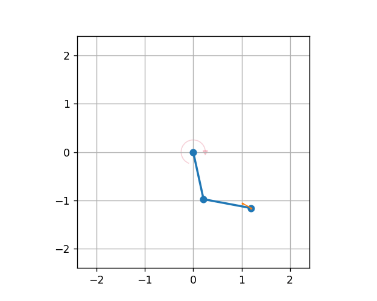

`Double Pendulum <https://github.com/fhswf/MLPro/blob/main/src/mlpro/rl/pool/envs/doublependulum.py>`_
^^^^^^^^^^^^^^^^^^^^^^^^^^^^^^^^^^^^^^^^^^^^^^^^^^^^^^^^^^^^^^^^^^^^^^^^^^^^^^^^^^^^^^^^^^^^^^^^^^^^^^^^^^^^^^^^
The Double Pendulum environment is an implementation of a classic control problem of Double Pendulum system. The dynamics of the system are based on the `Double Pendulum <https://matplotlib.org/stable/gallery/animation/double_pendulum.html>`_ implementation by `Matplotlib <https://matplotlib.org/>`_. The double pendulum is a system of two poles, with the inner pole connected to a fixed point at one end and to outer pole at other end. The native implementation of Double Pendulum consists of an input motor providing the torque in either directions to actuate the system. The figure below shows the the visualisation of MLPro's Double Pendulum environment.

    
The double pendulum environment can be imported via:

.. code-block:: python

    import mlpro.rl.pool.envs.doublependulum

The environment can be initialised with specifying the initial angles of both poles, masses of both poles, lenghts of poles, maximum torque value and scenario related parameters including step size and actuation step size. The initial positions of the poles refer to the position of the poles at the beginning of each RL episode, which can be set to 'up', 'down', 'random'. The default values for length and mass of each pole in the double pendulum are set to 1 and 1 respectively. The environment behaviour can be understood by running How To 20 in MLPro's sample implementation examples. Running How to 20 will produce following logging and visualisation.

	
.. note::
 + The visualisation of the environment can be turned off by setting the visualize parameter in training/scenario initialisation to false
 + Since it is not an episodical environment, the length of the run can be set by setting the number of cycles parameter
 
    
Prerequisites
=============
Please install below packages to use the MLPro's double pendulum environment

    - `NumPy <https://pypi.org/project/numpy/>`_
    - `Matplotlib <https://pypi.org/project/matplotlib/>`_
    - `SciPy <https://pypi.org/project/scipy/>`_
    - :ref:`MLPro <Installation>`

General Information
===================

+------------------------------------+-------------------------------------------------------+
|         Parameter                  |                         Value                         |
+====================================+=======================================================+
| Agents                             | 1                                                     |
+------------------------------------+-------------------------------------------------------+
| Native Source                      | MLPro                                                 |
+------------------------------------+-------------------------------------------------------+
| Action Space Dimension             | [1,]                                                  |
+------------------------------------+-------------------------------------------------------+
| Action Space Base Set              | Real number                                           |
+------------------------------------+-------------------------------------------------------+
| Action Space Boundaries            | Depends on max_torque                                 |
+------------------------------------+-------------------------------------------------------+
| State Space Dimension              | [7,]                                                  |
+------------------------------------+-------------------------------------------------------+
| State Space Base Set               | Real number                                           |
+------------------------------------+-------------------------------------------------------+
| State Space Boundaries             | [-180, 180] for angle and None for speed              |
+------------------------------------+-------------------------------------------------------+
| Reward Structure                   | Overall reward                                        |
+------------------------------------+-------------------------------------------------------+
 
Action Space
============
The goal of the environment is to maintain the vertical position of both the poles. The inner pole is actuated by a motor, and thus the action space of Double Pendulum environment is a continuous variable ranging between the negative maximum torque and positive maximum torque, where positive torque refers to clockwise torque and vice versa. The max torque can be passed as a :ref:`parameter <Double Pendulum>` in the initialisation of environment. 

+------------------------------------+-------------------------------------------------------+
|         Parameter                  |                         Range                         |
+====================================+=======================================================+
| Torque                             | [-max_torque, max_torque]                             |
+------------------------------------+-------------------------------------------------------+

State Space
===========

The state space for the double pendulum environment returns state of poles in the system including angles of both poles, velocity of poles, angular acceleration of the poles. The states for double pendulum environment can be understood by the table below.

+------------------------------------+------------------------------------+----------------------------------+-------------------------------------------------------+
|         State                      |         Description                |               Range              |			Unit				     |
+====================================+====================================+==================================+=======================================================+
| Theta 1                            |Angle of the inner pole             | [-180, 180]	                     |	degrees                                              |
+------------------------------------+------------------------------------+----------------------------------+-------------------------------------------------------+
| Omega 1                            |Angular velocity of inner pole      | N.A.     	                     |	degrees per second                                   |
+------------------------------------+------------------------------------+----------------------------------+-------------------------------------------------------+
| Acc 1                              |Angular Acceleration of outer pole  | N.A.     	                     |	degrees per second squared                           |
+------------------------------------+------------------------------------+----------------------------------+-------------------------------------------------------+
| Theta 2                            |Angle of the outer pole             | [-180, 180]	                     |	degrees                                              |
+------------------------------------+------------------------------------+----------------------------------+-------------------------------------------------------+
| Omega 2                            |Angular velocity of outer pole      | N.A.                             |	degrees per second                                   |
+------------------------------------+------------------------------------+----------------------------------+-------------------------------------------------------+
| Acc 2                              |Angular acceleration of outer pole  | N.A.     	                     |	degrees per second squared                           |
+------------------------------------+------------------------------------+----------------------------------+-------------------------------------------------------+

.. note:: 
 The boundaries for the velocity and acceleration are highly influenced by the initital position of the arms and the current torque being actuated on the inner pole. These parameters are further dependent on the specific application, scenario or purpose of research.  

Reward Structure
================

The reward calculation takes into account the position, speed and acceleration both pendulum. The class variable y take notes of the ODE frames of the states. This is formulated with the purpose of giving high reward whenever the pendulum stays upright while also minding the speed and acceleration of each pendulum. The position, speed, and acceleration is not taken at face value but instead is treated as a percentage of a defined constant (\pi). Additionally, a weighting system is used in the reward calculation to scale the importance of inner and outer pendulum rewards. The torque exerted by the motor (alpha) is taken as negative reward and the difference between the old state and new state is also taken into account.

.. code-block:: python
    
    reward = Reward(Reward.C_TYPE_OVERALL)
        
    target = np.array([np.pi, 0.0, np.pi, 0.0])
    state = p_state_new.get_values()
    old_state = p_state_old.get_values()
    
    th1_count = 0
    for th1 in self.y[::-1, 0]:
        ang = np.degrees(DoublePendulum.angle_normalize(th1))
        if ang > 170 or ang < 190 or \
                ang < -170 or ang > -190:
            th1_count += 1
        else:
            break
    th1_distance = np.pi - abs(DoublePendulum.angle_normalize(np.radians(state[0])))
    th1_distance_costs = 4 if th1_distance <= 0.1 else 0.3 / th1_distance
    
    th1_speed_costs = np.pi * abs(state[1]) / self.max_speed
    
    # max acceleration in one timestep is assumed to be double the max speed
    th1_acceleration_costs = np.pi * abs(self.y[-1, 1]-self.y[-2, 1]) / (2 * self.max_speed)
    
    inner_pole_costs = (th1_distance_costs * th1_count / len(self.y)) - th1_speed_costs - (th1_acceleration_costs ** 0.5)
    inner_pole_weight = (self.l1/2)*self.m1
    
    th2_count = 0
    for th2 in self.y[::-1, 2]:
        ang = np.degrees(DoublePendulum.angle_normalize(th2))
        if ang > 170 or ang < 190 or \
                ang < -170 or ang > -190:
            th2_count += 1
        else:
            break
    th2_distance = np.pi - abs(DoublePendulum.angle_normalize(np.radians(state[2])))
    th2_distance_costs = 4 if th2_distance <= 0.1 else 0.3 / th2_distance
    
    th2_speed_costs = np.pi * abs(state[3]) / self.max_speed
    
    th2_acceleration_costs = np.pi * abs(self.y[-1, 3]-self.y[-2, 3]) / (2 * self.max_speed)
    
    outer_pole_costs = (th2_distance_costs * th2_count / len(self.y)) - th2_speed_costs - (th2_acceleration_costs ** 0.5)
    outer_pole_weight = 0.5 * (self.l2/2)*self.m2
    
    change_costs = ((np.linalg.norm(target[::2] - np.array(old_state)[::2])*inner_pole_weight) - 
                    (np.linalg.norm(target[::2] - np.array(state)[::2])*outer_pole_weight))
    
    reward.set_overall_reward((inner_pole_costs * inner_pole_weight) + (outer_pole_costs * outer_pole_weight) 
                              - (self.alpha * np.pi/2) + (change_costs))

    return reward
    

Change Log
==========
    
+--------------------+---------------------------------------------+
| Version            | Changes                                     |
+====================+=============================================+
| 1.0.0              | First public version                        |
+--------------------+---------------------------------------------+
| 1.0.2              | Cleaning the code                           |
+--------------------+---------------------------------------------+
| 1.3.1              | Current release version                     |
+--------------------+---------------------------------------------+
  
Cross Reference
===============
    + :ref:`API Reference <Double Pendulum>`