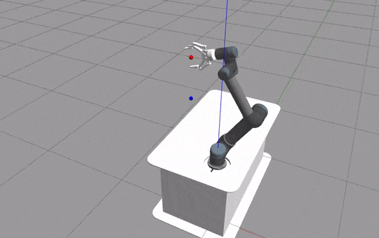

.. _ur5jointcontrol:
`Universal Robots 5 Joint Control <https://github.com/fhswf/MLPro/blob/main/src/mlpro/rl/pool/envs/ur5jointcontrol.py>`_
^^^^^^^^^^^^^^^^^^^^^^^^^^^^^^^^^^^^^^^^^^^^^^^^^^^^^^^^^^^^^^^^^^^^^^^^^^^^^^^^^^^^^^^^^^^^^^^^^^^^^^^^^^^^^^^^^^^^^^^^^^^^

      
      
This UR5 environment's task is to align the red ball to the blue ball.
It can be imported via:

.. code-block:: python

    import mlpro.rl.pool.envs.ur5jointcontrol
    

Prerequisites
=============

The environment has been tested in Ubuntu 20.04 running ROS Noetic. 
        
The installation steps are as follow:
    1. Install `Ubuntu 20.04 <https://releases.ubuntu.com/20.04/>`_
    2. Install `ROS <http://wiki.ros.org/noetic/Installation/Ubuntu>`_
    3. Install `Moveit <https://moveit.ros.org/install/>`_
    4. Install Dependencies:
        .. code-block:: bash
                 
            sudo apt-get install ros-$ROS_DISTRO-ur-client-library ros-$ROS_DISTRO-joint-trajectory-controller ros-$ROS_DISTRO-scaled-controllers ros-$ROS_DISTRO-speed-scaling-interface ros-$ROS_DISTRO-speed-scaling-state-controller ros-$ROS_DISTRO-pass-through-controllers

        .. code-block:: bash

            sudo apt install python3-pip

        .. code-block:: bash

            pip3 install catkin_tools gym empy defusedxml pymodbus numpy netifaces pycryptodomex rospkg gnupg
                    
    5. Build the Environment:
        .. code-block:: bash
        
            cd MLPro/src/mlpro/rl/pool/envs/ur5jointcontrol/src
            git submodule update --init
            cd .. && catkin_make
            
    6. Source the package:
        .. code-block:: bash
                
            echo "source MLPro/src/mlpro/rl/pool/envs/ur5jointcontrol/devel/setup.bash" >> ~/.bashrc
            source ~/.bashrc
                
    
General Information
===================

+------------------------------------+-------------------------------------------------------+
|         Parameter                  |                         Value                         |
+====================================+=======================================================+
| Agents                             | 1                                                     |
+------------------------------------+-------------------------------------------------------+
| Native Source                      | MLPro                                                 |
+------------------------------------+-------------------------------------------------------+
| Action Space Dimension             | [6,]                                                  |
+------------------------------------+-------------------------------------------------------+
| Action Space Base Set              | Real number                                           |
+------------------------------------+-------------------------------------------------------+
| Action Space Boundaries            | [-0.1, 0.1]                                           |
+------------------------------------+-------------------------------------------------------+
| State Space Dimension              | [6,]                                                  |
+------------------------------------+-------------------------------------------------------+
| State Space Base Set               | Real number                                           |
+------------------------------------+-------------------------------------------------------+
| State Space Boundaries             | [-2.0, 2.0]                                           |
+------------------------------------+-------------------------------------------------------+
| Reward Structure                   | Overall reward                                        |
+------------------------------------+-------------------------------------------------------+
      

Action Space
============
    
The action of the agent directly affects the joint angles (rad) of the robot. The action is 
interpreted as increments towards the current value. 
  
+--------------------+---------------------+-----------------------+
| Actuator           | Parameter           | Boundaries            |
+====================+=====================+=======================+
| Shoulder Pan Joint | rad                 | [-0.1, 0.1]           |
+--------------------+---------------------+-----------------------+
| Shoulder Lift Joint| rad                 | [-0.1, 0.1]           |
+--------------------+---------------------+-----------------------+
| Elbow Joint        | rad                 | [-0.1, 0.1]           |
+--------------------+---------------------+-----------------------+
| Wrist 1 Joint      | rad                 | [-0.1, 0.1]           |
+--------------------+---------------------+-----------------------+
| Wrist 2 Joint      | rad                 | [-0.1, 0.1]           |
+--------------------+---------------------+-----------------------+
| Wrist 3 Joint      | rad                 | [-0.1, 0.1]           |
+--------------------+---------------------+-----------------------+

State Space
===========
    
The state space consists of position information of the end effector (Red Ball) and 
the target location (Blue Ball). 
  
+--------------------+---------------------------------------------+-----------------------+
| Element            | Parameter                                   | Boundaries            |
+====================+=============================================+=======================+
| PositionX          | m                                           | [-2.0, 2.0]           |
+--------------------+---------------------------------------------+-----------------------+
| PositionY          | m                                           | [-2.0, 2.0]           |
+--------------------+---------------------------------------------+-----------------------+
| PositionZ          | m                                           | [-2.0, 2.0]           |
+--------------------+---------------------------------------------+-----------------------+
| Targetx            | m                                           | [-2.0, 2.0]           |
+--------------------+---------------------------------------------+-----------------------+
| Targety            | m                                           | [-2.0, 2.0]           |
+--------------------+---------------------------------------------+-----------------------+
| Targetz            | m                                           | [-2.0, 2.0]           |
+--------------------+---------------------------------------------+-----------------------+

Reward Structure
================
    
.. code-block:: python
    
    distance = np.linalg.norm(np.array(observations[:3]) - np.array(observations[3:]))
    ratio = distance/self.init_distance
    reward = -np.ones(1)*ratio
    reward = reward - 10e-3

    if done:
        reward += self.reached_goal_reward
      

Change Log
==========
    
+--------------------+---------------------------------------------+
| Version            | Changes                                     |
+====================+=============================================+
| 1.0.7              | First public version                        |
+--------------------+---------------------------------------------+

Cross Reference
===============
    + :ref:`API Reference <UR5 Arm Robot>`
    + :ref:`Howto 14 - (RL) Train UR5 with SB3 wrapper <Howto RL 14>`
    + `UR5 Product Page (Unaffiliated) <https://www.universal-robots.com/products/ur5-robot/>`_