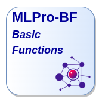
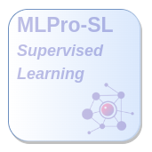
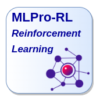

.. MLPro Documentations documentation master file, created by
   sphinx-quickstart on Wed Sep 15 12:06:53 2021.
   You can adapt this file completely to your liking, but it should at least
   contain the root `toctree` directive.

MLPro - Machine Learning Professional
=====================================

Welcome to MLPro - the integrative middleware-framework for standardized machine learning in Python!

MLPro
   - enables hybrid ML applications in just one framework
   - provides complete process landscapes and powerful ML templates on a scientific level
   - integrates a growing number of :ref:`proven ML packages <target_wrappers>` 
   - enables comparable and reproducible results in publications
   - is open source and even commercially usable (`Apache License 2.0 <https://github.com/fhswf/MLPro/blob/main/LICENSE>`_)

.. |mlpro_gt| image:: content/images/mlpro_gt.png
   :scale: 65 %
   :target: index_05_mlpro_gt.html

.. |mlpro_oa| image:: content/images/mlpro_oa.png
   :scale: 65 %
   :target: index_06_mlpro_oa.html

.. |examples| image:: content/images/example_pool.png
   :scale: 65 %
   :target: index_99_appendix1.html

.. |mlpro_api| image:: content/images/api_reference.png
   :scale: 65 %
   :target: index_99_appendix2.html

.. |project| image:: content/images/project_mlpro.png
   :scale: 65 %
   :target: index_99_appendix3.html

|welcome| |mlpro_bf| |mlpro_sl| |mlpro_rl| |mlpro_gt|

|mlpro_oa| |examples| |mlpro_api| |project| |publications|

.. |mlpro_pypi| image:: content/images/pypi.svg
   :target: https://pypi.org/project/mlpro
   :scale: 50 %

.. |mlpro_anaconda| image:: content/images/anaconda.png
   :target: https://anaconda.org/mlpro/mlpro
   :scale: 11 %

.. |mlpro_github| image:: content/images/github.png
   :target: https://github.com/fhswf/MLPro
   :scale: 2 %

.. |mlpro_rg| image:: content/images/researchgate.jpeg
   :target: https://www.researchgate.net/project/MLPro-A-Synoptic-Framework-for-Standardized-Machine-Learning-Tasks-in-Python
   :scale: 6 %

MLPro is also present on...

.. list-table::

   * - |mlpro_pypi| `Python Package Index (PyPI) <https://pypi.org/project/mlpro>`_
     - |mlpro_anaconda| `Anaconda.org <https://anaconda.org/mlpro/mlpro>`_
     - |mlpro_github| `GitHub <https://github.com/fhswf/MLPro>`_
     - |mlpro_rg| `ResearchGate <https://www.researchgate.net/project/MLPro-A-Synoptic-Framework-for-Standardized-Machine-Learning-Tasks-in-Python>`_

.. toctree::
   :hidden:
   :maxdepth: 3
   :caption: 1 Welcome to MLPro
   :glob:

   content/intro/*

.. toctree::
   :hidden:
   :maxdepth: 2
   :caption: 2 MLPro-BF – Basic Functions
   :glob:
   
   content/bf/*

.. toctree::
   :hidden:
   :maxdepth: 3
   :caption: 3 MLPro-SL - Supervised Learning
   :glob:
   
   content/sl/*

.. toctree::
   :hidden:
   :maxdepth: 3
   :caption: 4 MLPro-RL - Reinforcement Learning
   :glob:

   content/rl/*

.. toctree::
   :hidden:
   :maxdepth: 2
   :caption: 5 MLPro-GT – Game Theory
   :glob:
   
   content/gt/*

.. toctree::
   :hidden:
   :maxdepth: 1
   :caption: 6 MLPro-OA – Online Adaptivity
   :glob:

   content/oa/*

.. toctree::
   :hidden:
   :maxdepth: 3
   :caption: Appendix 1: Examples
   :glob:
   
   content/append1/*

.. toctree::
   :hidden:
   :maxdepth: 6
   :caption: Appendix 2: API Reference
   :glob:
   
   content/append2/*

.. toctree::
   :hidden:
   :maxdepth: 2
   :caption: Appendix 3: Project MLPro
   :glob:
   
   content/append3/*