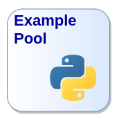
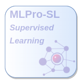
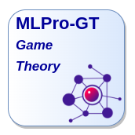
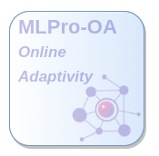

.. MLPro Documentations documentation master file, created by
   sphinx-quickstart on Wed Sep 15 12:06:53 2021.
   You can adapt this file completely to your liking, but it should at least
   contain the root `toctree` directive.

MLPro - Machine Learning Professional
=====================================

Welcome to MLPro - the integrative middleware-framework for standardized machine learning in Python!

MLPro is developed by computer scientists and engineers to
   - support real world ML projects at a high quality level
   - integrate numerous established ML packages in a consistent process landscape
   - enable exchange and reuse of standardized ML code
   - achieve comparable and reproducible results in publications
   
For this purpose, MLPro provides advanced models and templates at a scientific level for a constantly growing number of sub-areas of machine learning.
These are embedded in standard processes for training and real operations. But of course we have not reinvented existing wheels. An integral part of MLPro's philosophy is to seamlessly integrate proven functionalities of relevant 3rd party packages instead of developing them again.
The scope is rounded off by numerous executable example programs that make it easier to get started in the world of MLPro.

.. |welcome| image:: content/intro/images/welcome.png
   :scale: 65 %
   :target: index.html#target-intro

.. |mlpro_rl| image:: content/intro/images/mlpro_rl.png
   :scale: 65 %
   :target: index.html#target-mlpro-rl

|welcome| |project| 

Sub-frameworks...

|mlpro_bf| |mlpro_rl| |mlpro_gt| |mlpro_oa| |mlpro_sl|

For developers...

|examples| |mlpro_api| 

.. |mlpro_pypi| image:: content/intro/images/pypi.svg
   :scale: 50 %

.. |mlpro_anaconda| image:: content/intro/images/anaconda.svg
   :scale: 100 %

.. |mlpro_rg| image:: content/intro/images/researchgate.jpeg
   :scale: 6 %

.. |mlpro_github| image:: content/intro/images/github.png
   :scale: 2 %

MLPro is also present on...

.. list-table::

   * - |mlpro_pypi|
     - `Python Package Index (PyPI) <https://pypi.org/project/mlpro/>`_

   * - |mlpro_anaconda|
     - `Anaconda <https://anaconda.org/mlpro/mlpro/>`_

   * - |mlpro_rg|
     - `ResearchGate <https://www.researchgate.net/project/MLPro-A-Synoptic-Framework-for-Standardized-Machine-Learning-Tasks-in-Python>`_

   * - |mlpro_github|
     - `GitHub <https://github.com/fhswf/MLPro>`_
     

Table of Content
================

.. _target_intro:
.. toctree::
   :maxdepth: 1
   :caption: 1 Introduction
   
   content/intro/overview
   content/intro/getstarted
   content/intro/architecture

.. _target_bf:
.. toctree::
   :maxdepth: 2
   :caption: 2 MLPro-BF – Basic Functions
   :glob:
   
   content/bf/*

.. _target_mlpro_sl:
.. toctree::
   :maxdepth: 3
   :caption: 3 MLPro-SL - Supervised Learning
   :glob:
   
   content/sl/*

.. _target_mlpro_rl:
.. toctree::
   :maxdepth: 3
   :caption: 4 MLPro-RL - Reinforcement Learning
   :glob:

   content/rl/*

.. _target_mlpro_gt:
.. toctree::
   :maxdepth: 2
   :caption: 5 MLPro-GT – Game Theory
   :glob:
   
   content/gt/*

.. _target_mlpro_oa:
.. toctree::
   :maxdepth: 1
   :caption: 6 MLPro-OA – Online Adaptivity
   :glob:

   content/oa/*

.. _target_appendix1:
.. toctree::
   :maxdepth: 2
   :caption: Appendix 1: Examples
   
   content/append1/howto.bf
   content/append1/howto.rl
   content/append1/howto.gt
   content/append1/howto.oa

.. _target_appendix2:
.. toctree::
   :maxdepth: 6
   :caption: Appendix 2: API Reference
   
   content/append2/mlpro.core
   content/append2/mlpro.wrappers
   content/append2/mlpro.pool
   content/append2/mlpro.template

.. _target_appendix3:
.. toctree::
   :maxdepth: 2
   :caption: Appendix 3: Project MLPro
   
   content/append3/versions
   content/append3/publications
   content/append3/cont
   content/append3/disclaimer
   

Contact Data
------------------------
Mail: mlpro@listen.fh-swf.de
